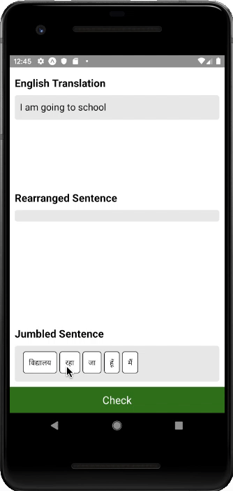

# react-native-jumbled-sentence
React Native npm module

# installation
```npm install react-native-jumbled-sentence```

# usage
```
<JumbledSentence 
    hint = {{title: "English Translation", description: "I am going to school"}}
    sentenceToJumble = {["मैं विद्यालय जा रहा हूँ"]}
    onSuccess = {this.onSuccess}
    onFailure = {this.onFailure}
/>
```

# demo


# another usage
```
<JumbledSentence
    sentenceToJumble = {["she is going to the school", "is she going to the school"]}
    onSuccess = {this.onSuccess}
    onFailure = {this.onFailure}
/>
```
# demo

